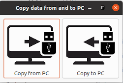

# Sneakernet

Sneakernet (snēk-ər-net): a slang term referring to the act of physically transporting data between computers rather than sharing over a network. The name is a play on the sneakers worn by whoever transports the data in physical space and the term network.

The script's intended usage is to facilitate copying directory trees from an simple Windows or Linux device without network connection to an USB pen drive. It also serves as an example of how with relatively ease a terse command-line utility can turn into a user-friendly UI app using Python and GTK.

## Installation

Obtain a clone of this repository
Use the package manager [pip](https://pip.pypa.io/en/stable/) to install [pipenv](https://pipenv.pypa.io/en/latest/). Use pipenv to install the application dependencies.

```bash
pip install pipenv

pipenv sync
```
# Prerequisites and documentation

 - [Python](https://www.python.org/)
 - [PGobject](https://pygobject.readthedocs.io/en/latest/index.html) is a Python package which provides bindings for GObject based libraries such as GTK, GStreamer, WebKitGTK, GLib, GIO and many more. If you want to write a Python application for GNOME or a Python GUI application using GTK, then PyGObject is the way to go.
 - [Python GTK 3 Tutorial](https://pygobject.readthedocs.io/en/latest/getting_started.html)
 - [PyGObject API Reference](https://lazka.github.io/pgi-docs/)


## Usage

The program is started through the command line, specifying origin and destination directories.

```bash
sneakernet.py «pc» «remote/device»
```

Note that not only local and USB drives are supported (as depicted in the UI) but all path expressions supported by Python's Distutils library can be given. For example:

```bash
sneakernet.py c:\src\my-project e:\backup
```
or

```bash
sneakernet.py \\server\my-project \\networkdevice\backup
```

After the script starts the following UI is shown:



The UI should be self-evident.

## Contributing
Pull requests are welcome. For major changes, please open an issue first to discuss what you would like to change.

Please make sure to update tests as appropriate.

## License
[BSD-3-Clause](https://choosealicense.com/licenses/bsd-3-clause-clear/)
